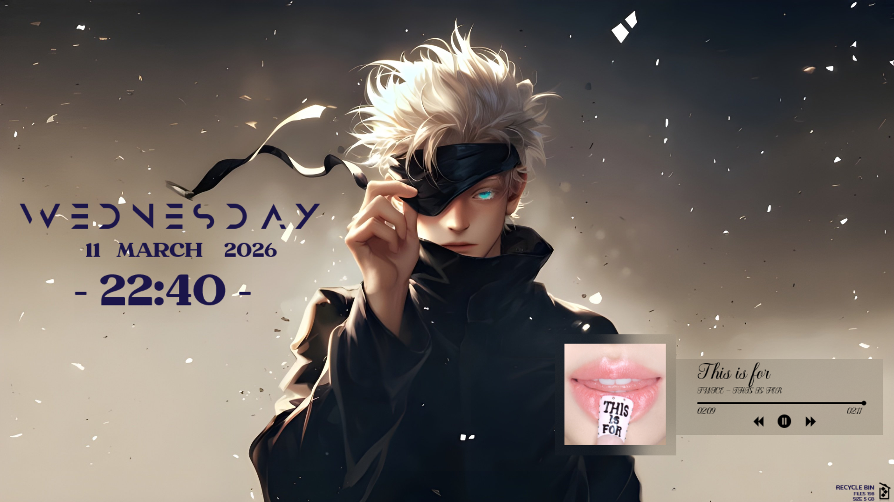

# WebNowPlaying & FrostedGlass Rainmeter Skin Reimagined

A high-performance, minimalist media controller for Rainmeter. This skin focuses on seamless **System Integration** with Spotify and modern **UI/UX Customization** through advanced visual plugins.

## 🚀 Key Features
* **Logic-Driven Controls:** Precision-tuned play/pause and progress bar functionality using the **WebNowPlaying API**.
* **FrostedGlass Integration:** Implements real-time background blur for a native, aesthetic Windows 11 look.
* **Responsive Progress Bar:** Custom-scaled progress tracking with low CPU overhead.
* **Typography:** Includes high-quality font assets for a clean, modern interface.

## 🛠️ Built With
* **Rainmeter** (Skin Engine)
* **Lua** (Configuration Logic)
* **WebNowPlaying Plugin** (Media Metadata)
* **FrostedGlass Plugin** (Visual Effects)

## 📂 Typography (Included in @Resources)
The following fonts are available to ensure visual consistency:
* **Flowmery** - Used for primary metadata.
* **Flowmery** - Used for secondary controls.
*(Note: Replace these with the actual font names found in your @Resources folder.)*

## 📸 Preview

## 🔧 Installation
1. Ensure you have **Rainmeter** installed.
2. Download the contents of this repo into your `Skins` directory.
3. Install the **WebNowPlaying** and **FrostedGlass** plugins if you haven't already.
4. Load `MusicPlayer.ini` through the Rainmeter Manager.